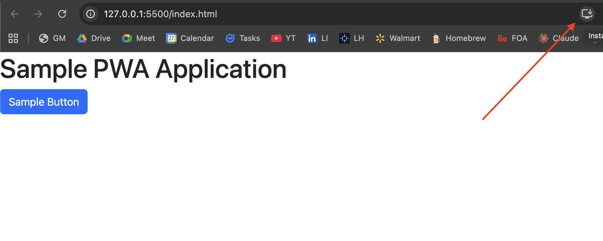

# Progressive-Web-Application-Sample


## Included Files

There are a number of files required for a PWA to function. This section will provide a gentle introduction to the minimum requirements of each file.

### index.html
The `index.html` file is your markup for what will be displayed on the webpage. For a PWA this looks markedly similar to what a standard HTML file looks like for any other sort of web project. In the example contained in this repository, Bootstrap is used for styling and the code following comment (1) links up the approriate style sheet and javascript. Following comment (2) is a sample main content. Finally, (3) links up the script for your application, `app.js`.

```html
<html lang="en">

    <head>
        <title>Sample PWA</title>
        <meta charset="UTF-8">
        <link rel="manifest" href="manifest.json">

        <!-- (1) Bootstrap - Styles and and Scripting -->
        <link rel="stylesheet" href="https://cdn.jsdelivr.net/npm/bootstrap@5.3.8/dist/css/bootstrap.min.css" crossorigin="anonymous">
        <script src="https://cdn.jsdelivr.net/npm/bootstrap@5.3.8/dist/js/bootstrap.bundle.min.js" crossorigin="anonymous"></script>
    </head>

    <body>
        <!-- (2) Main content -->
        <h1>Sample PWA Application</h1>
        <button class="btn btn-primary">Sample Button</button>

        <!-- (3) Set up application script at the end of the body tag -->
        <script src="js/app.js"></script>
    </body>

</html>
```

### app.js
The `app.js` contains one essential piece of code that should not be changed:
```javascript
// (1) Boilerplate for registering the service worker - DO NOT CHANGE THIS
if ("serviceWorker" in navigator) {
  window.addEventListener("load", function() {
    navigator.serviceWorker
      .register("serviceworker.js")
      .then(_ => console.log("Service worker registered."))
      .catch(err => console.log("service worker not registered.", err));
  });
}
```

This block of code simply wires up your `serviceworker.js` which contains the code that makes your PWA a PWA.

### serviceworker.js
With the exception of the `filesToCache` array, the `serviceworker.js` file should largely be unchanged throughout the development of your PWA:
```javascript
// (1) Name of cache - DO NOT CHANGE THIS 
var cacheName = 'epwa';

// (2) Files to cache offline for your PWA - ADD NEW FILES HERE
var filesToCache = [
  '/',
  'index.html',
  'serviceworker.js',
  'manifest.json',
];

// (3) Install boilerplate - DO NOT CHANGE THIS
self.addEventListener("install", installEvent => {
  installEvent.waitUntil(
    caches.open(staticDevCoffee).then(cache => {
      cache.addAll(assets);
    })
  );
});

// (4) Fetch bolerplate - DO NOT CHANGE THIS 
self.addEventListener("fetch", fetchEvent => {
  fetchEvent.respondWith(
    caches.match(fetchEvent.request).then(res => {
      return res || fetch(fetchEvent.request);
    })
  );
});
```

### manifest.json
The final necessary file for your PWA to function is a `manifest.json` file. This is simply a file that contains metadata regarding your application with the following required properties:
```json
{
  "short_name": "Short Name of PWA",
  "name": "Detailed Name of PWA",
  "icons": [
    {
      "src": "icon-192x192.png",
      "sizes": "192x192",
      "type": "image/png"
    },
    {
      "src": "icon-512x512.png",
      "sizes": "512x512",
      "type": "image/png"
    }
  ],
  "start_url": "index.html",
  "display": "standalone",
  "theme_color": "black",
  "background_color": "white"
}
```

All of these properties are required, including the icons! Any missing files or properties will cause your PWA not to work.

### Success
If all of the above files are functioning correctly, you should notice the following install button in your address bar when you serve the application:
